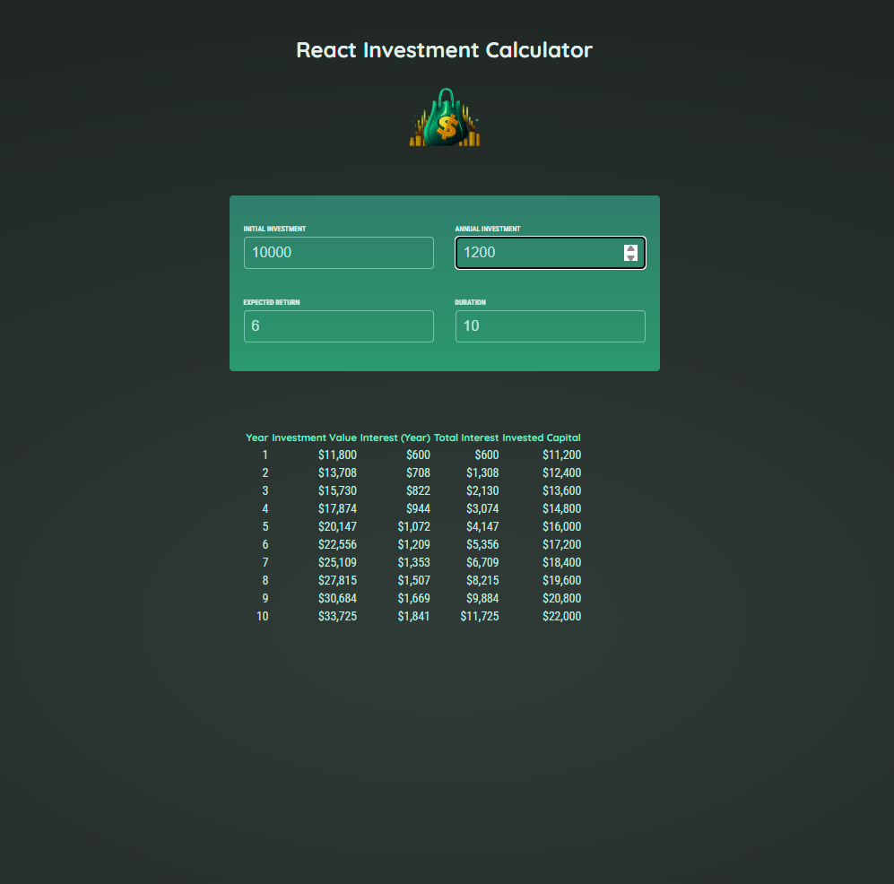

# React Investment Calculator

 

A React-based investment calculator that lets you enter your initial investment, annual contribution, expected return rate, and duration, then calculates and displays your investment growth over time.

---

## 📌 Features
- Real-time calculation (no need to click a button)
- Displays yearly:
  - Investment value
  - Interest earned that year
  - Total interest earned so far
  - Invested capital
- Currency formatting for neat display
- Styled with CSS for a clean, responsive UI

---

## 🛠 Tech Stack
- **React** (Functional components + Hooks)
- **JavaScript ES6+**
- **CSS**
- **Intl.NumberFormat API** for currency formatting

---

## 📂 Project Structure

src/
components/
Header.jsx
UserInput.jsx
ResultsTable.jsx
util/
investment.js
App.jsx
index.js


---

## 🚀 Getting Started

### 1️⃣ Clone the repository
```
git clone https://github.com/your-username/react-investment-calculator.git
cd react-investment-calculator

2️⃣ Install dependencies

npm install

3️⃣ Start the development server

npm start
The app will run at http://localhost:3000

📖 Usage
Enter:

Initial Investment

Annual Investment

Expected Return (%)

Duration (Years)

The table will update in real-time with:

Year number

Value at end of year

Interest earned for the year

Total interest earned so far

Total invested capital

🧮 Calculation Logic

The main logic lives in src/util/investment.js:

Loops over the duration in years

Calculates yearly interest and adds it to investment value

Adds annual investment

Returns an array of yearly result objects

Uses Intl.NumberFormat for currency formatting


